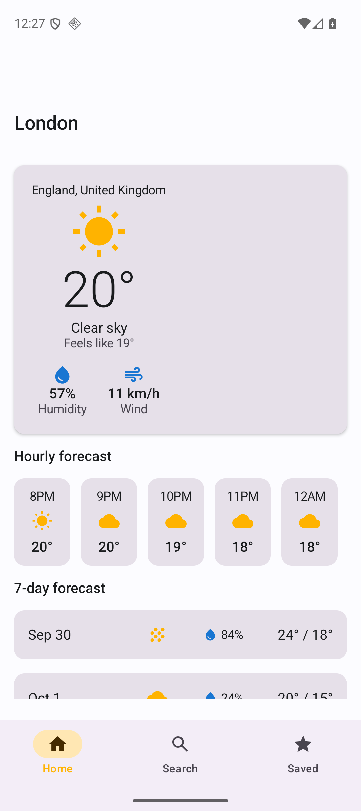
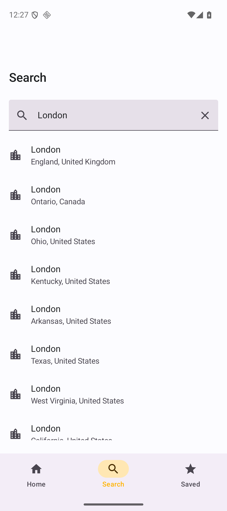
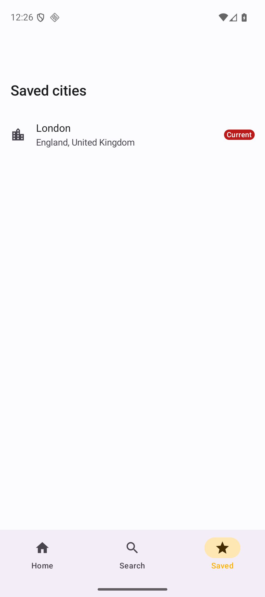
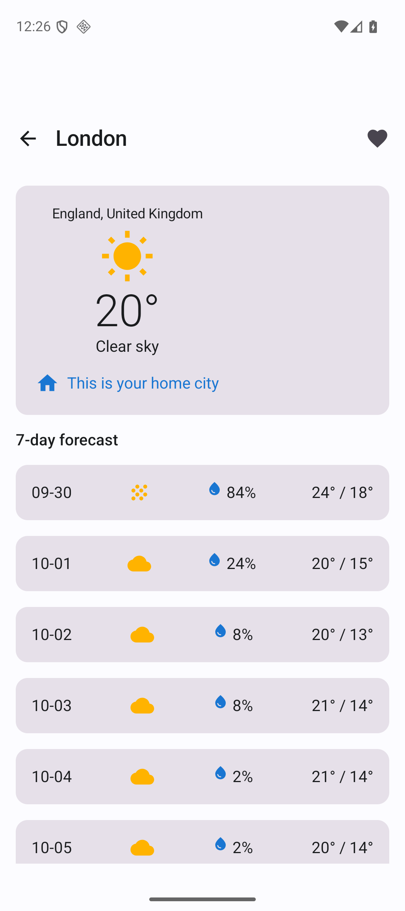

# WeatherNow

A production-quality native Android weather forecast app built with Kotlin and Jetpack Compose, following Clean Architecture and MVVM. This is app 1 of a 7-app Android portfolio series and serves as the architectural template for the remaining apps.

## Features

- **Home** — shows the current conditions, hourly forecast, and 7-day forecast for your selected city, with loading/empty ("no city selected yet")/error states.
- **Search** — debounced, live city search (geocoding) with loading/empty/error states.
- **Saved Cities** — swipe-to-delete list of favorited cities, with a badge marking the current Home city.
- **City Detail** — full forecast for any searched or saved city, with the ability to favorite it and set it as your Home city.
- Offline-friendly favorites: saved cities and the selected Home city persist locally (Room) and survive process death.
- Graceful error handling throughout: distinguishes "no internet connection" from server errors and generic failures, always with a retry path.

## Tech stack & architecture

- **Language:** Kotlin
- **UI:** Jetpack Compose + Material 3, single-activity, Navigation Compose
- **DI:** Hilt
- **Networking:** Retrofit + OkHttp, with a small hand-written `kotlinx.serialization` `Converter.Factory` (see note below)
- **Local storage:** Room
- **Async:** Kotlin Coroutines + Flow / StateFlow throughout
- **Build:** Kotlin DSL (`build.gradle.kts`) with a Gradle version catalog (`gradle/libs.versions.toml`)

The codebase follows **Clean Architecture** with strict layer separation:

```
data/
  remote/       Retrofit services + DTOs + the JsonConverterFactory
  local/        Room database, DAO, entities
  mapper/       DTO <-> domain and entity <-> domain mappers
  repository/   Repository implementations (data sources -> domain models)
domain/
  model/        Plain Kotlin domain models (City, WeatherForecast, ...)
  repository/   Repository interfaces (contracts only)
  usecase/      One class per use case (SearchCitiesUseCase, GetWeatherForecastUseCase,
                SaveCityUseCase, DeleteCityUseCase, SelectCityUseCase,
                GetSavedCitiesUseCase, GetSelectedCityUseCase, IsCitySavedUseCase)
  util/         Resource<T> sealed class (Loading/Success/Error), shared mappers
presentation/
  home/         HomeScreen + HomeViewModel + HomeUiState
  search/       SearchScreen + SearchViewModel + SearchUiState
  saved/        SavedCitiesScreen + SavedCitiesViewModel + SavedCitiesUiState
  detail/       CityDetailScreen + CityDetailViewModel + CityDetailUiState
  navigation/   NavHost + Screen routes
  components/   Shared loading/empty/error composables, weather icon mapping
  theme/        Material 3 theme
di/             Hilt modules (NetworkModule, DatabaseModule, RepositoryModule)
```

Each screen follows MVVM: a `ViewModel` exposes a single `StateFlow<UiState>` built by combining use case flows, and the `@Composable` screen renders that state directly (loading / empty / error / content).

### Why a hand-written JSON converter factory

The published `com.squareup.retrofit2:converter-kotlinx-serialization` artifact (and the older `com.jakewharton.retrofit` equivalent) mark their public entry points `internal` in Kotlin at the versions compatible with this project's AGP 9 / Kotlin 2.2.10 toolchain, making them unusable from application code. Rather than depend on a fragile, version-mismatched third-party shim, `data/remote/converter/JsonConverterFactory.kt` implements Retrofit's `Converter.Factory` directly against `kotlinx.serialization.json.Json`, resolving each DTO's generated `Companion.serializer()` via plain reflection (no `kotlin-reflect` dependency needed, since every network response here is a plain, non-generic `@Serializable` class).

## API

Weather and geocoding data comes from **[Open-Meteo](https://open-meteo.com/)** — a free, open-source weather API that requires no API key for non-commercial use. This app calls:

- `https://geocoding-api.open-meteo.com/v1/search` — city name search
- `https://api.open-meteo.com/v1/forecast` — current/hourly/daily forecast

## Screenshots

| Home | Search | Saved Cities | City Detail |
|---|---|---|---|
|  |  |  |  |

## Requirements

- Android Studio (latest stable) or the command-line Android SDK
- JDK 17
- Android SDK Platform 37 (compileSdk/targetSdk), minSdk 24

## Setup

```bash
git clone https://github.com/manojmourya2505/weathernow-android.git
cd weathernow-android
./gradlew assembleDebug
```

To install on a running emulator or connected device:

```bash
./gradlew installDebug
```

No API key or `local.properties` secrets are required — Open-Meteo is free and keyless.

## Running tests

Unit tests (JUnit4, MockK, Turbine, kotlinx-coroutines-test) cover the repository implementations, use cases, and ViewModels:

```bash
./gradlew testDebugUnitTest
```

An instrumented Compose UI test is included under `app/src/androidTest`:

```bash
./gradlew connectedDebugAndroidTest
```

Continuous integration (`.github/workflows/ci.yml`) runs `testDebugUnitTest` on every push and pull request against `main`.

## License

[MIT](LICENSE)
